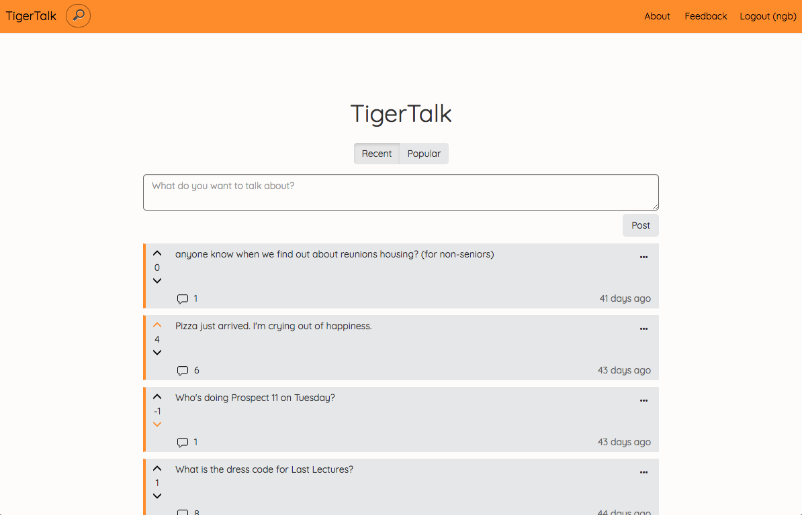

# Independent-Projects
## Independent CS projects in Java and Python

### BarcodeErrorCorrection.java 

Java program that implements a motif-finding algorithm to identify and error-correct DNA barcode tags used in single cell sequencing. The algorithm uses k-words (sequence used for pattern alignment) with an associated set of neighbors in the set of all k-letter words to identify a ‘consensus’ barcode by building hash tables to identify and record the occurance of all possible substitution, deletion and insertion error mutation permutations.  Algorithm identifies the original un-mutated barcodes in a data set of sequenced barcodes and uses the Levenshtein edit distance to determine the nearest original barcode to each mutated barcode in order to error correct the data set.

Through this algorithm, we found that we were able to generate 97% of the initial barcode library in our set of original barcodes. Furthermore, by error-correcting barcodes and keeping track of their counts, we were able to recover 570 out of 589 cells that were sequenced in a previously published Drop-Seq experiment by Macosko et al. Paper to be published Fall 2018. 

### Bidder.py and Auction.py 

Python program that implements Professor Matthew Weinberg’s low regret algorithms and uses machine learning to calculate the price at which a bidder should bid at in different types of auction scenarios to secure his lowest regret. Other applications of these algorithms could include credit scoring and price determination. The program uses Seaborn to visualize the results. 

### Genome.java

Java program that parses a file of DNA into 100 sequence reads and then assembles a genome by identifying the strings that don't belong in the genome, removing them and calculating the overlap between the prefixes and suffixes of the remaining strings. 

### TigerTalk.java

TigerTalk is a web-app designed to facilitate campus discussion across Princeton’s student body. Inspired by websites such as Quora, Reddit and RealTalk Princeton, TigerTalk will allow users to post text entries, questions and discussion topics to generate campus conversation. These posts could be anything from a question about possible fall courses to student opinions on an upcoming referendum and can be tagged to allow for easy searching.

Features include:
* Princeton CAS authentication
* Anonymous posts and comments
* Randomized colors for comment authors 
* Upvoting and downvoting
* Sorting posts by 'recent' and 'popular'
* Search functionality
* Sharing individual posts by URL
* Reporting posts and comments to admins

## Images
### Comment thread

### Search results

### Anonymous Posts and Comments (each user linked to a color on a post)
<a href="https://imgur.com/xZ3WcyH">

### Mobile responsive design
		

## Stack

TigerTalk is built on Django and the [Django REST Framework](http://www.django-rest-framework.org/), with a PostgreSQL database. The front-end is built with [React](https://reactjs.org/) and [React-Bootstrap](https://react-bootstrap.github.io/), which are compiled and bundled into a Django template using [Babel](https://babeljs.io/) and [Webpack](https://webpack.js.org/). Authentication is handled by [Princeton's CAS server](https://csguide.cs.princeton.edu/publishing/cas) and [django-cas-ng](https://github.com/mingchen/django-cas-ng). TigerTalk is deployed using Heroku, although a public version of the site is currently unavailable.
